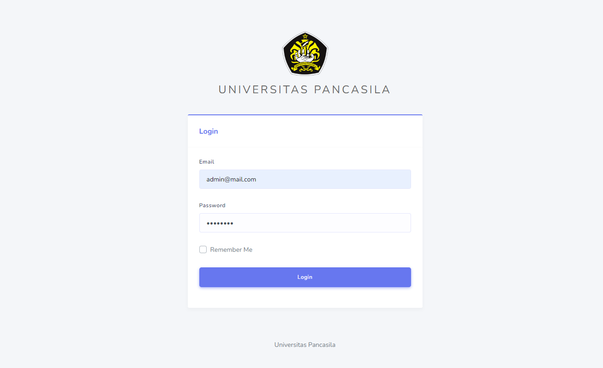
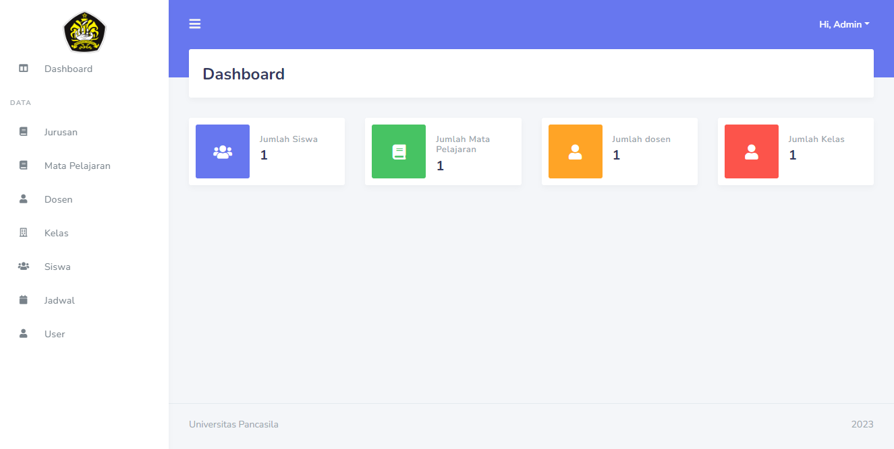
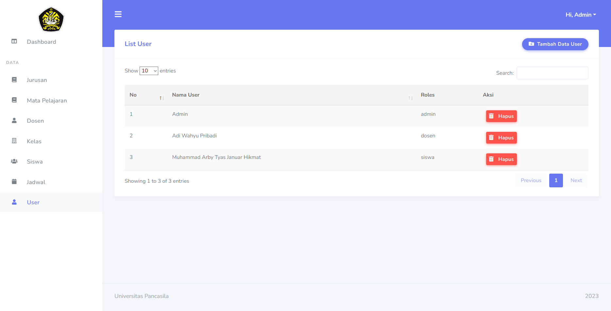
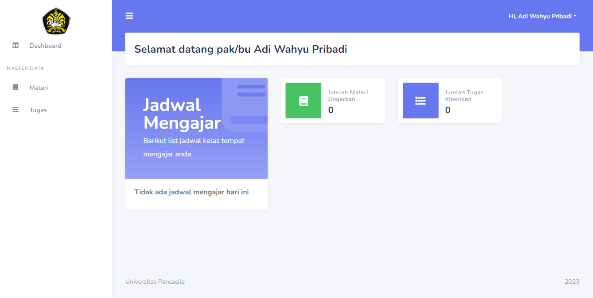
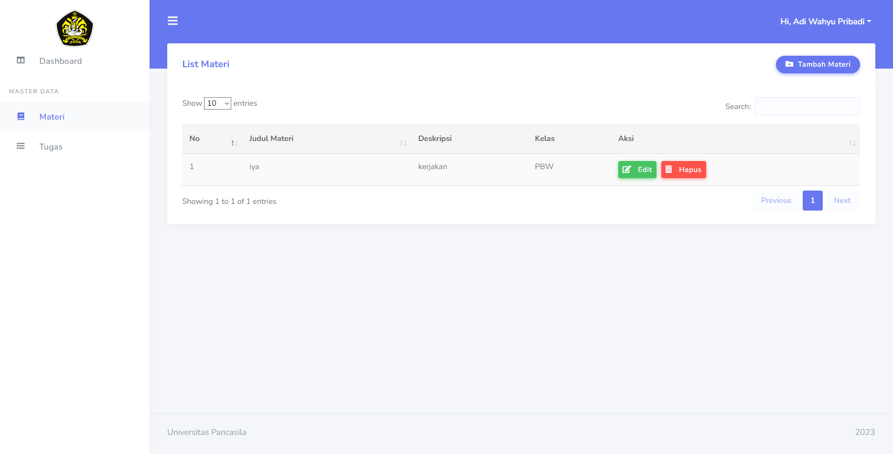
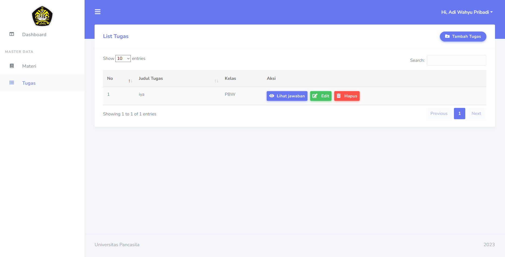
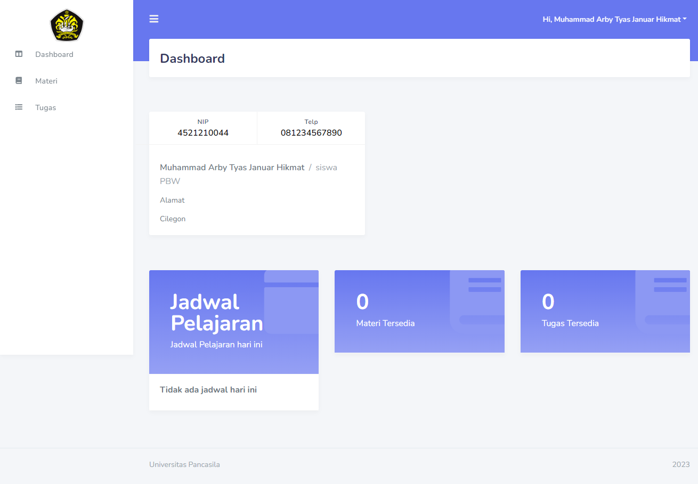
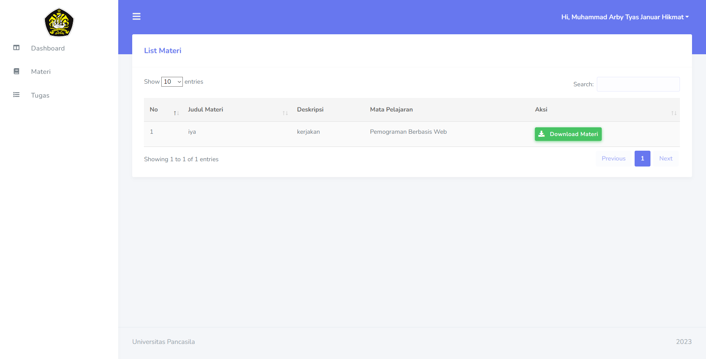
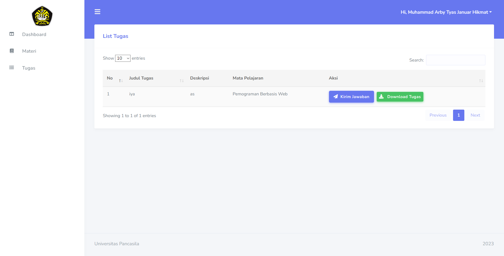

# WEB UAS SIAK
- Muhammad Arby Tyas Januar Hikmat : 4521210044
- Panca Purnama : 4521210040
- Sultan Rafi : 4521210065
# Penjelasan
WEB UAS SIAK merupakan web yang berfungsi untuk mengatur mahasiswa dan dosen di dunia perkuliahan. Web ini merupakan versi lebih lanjut dari web UTS SIAK
# Fitur
Ada 3 aktor di web ini, yaitu Admin, Dosen, dan Mahasiswa
## Admin
Untuk admin, di menu dashboard terlihat jumlah siswa,mata pelajaran, dosen, dan jumlah kelas yang ada. lalu admin bisa melakukan perubahan,penambahan,dan penghapusan untuk data jurusan, mata pelajaran, dosen, kelas, siswa, dan jadwal. lalu admin juga dapat menambahkan dan menghapus user yang telah dibuat
### Dosen
Untuk dosen, di menu dashboard terlihat jadwal mengajar, jumlah materi yang diajarkan, dan jumlah tugas yang diberikan. lalu untuk dosen bisa melakukan penambahan, perubahan, dan penghapusan untuk data materi dan tugas. dan dosen juga bisa melihat jawaban yang diberikan siswa dari tugas yang diberikan
### Siswa
Untuk siswa, di menu dashboard terlihat profil siswa dan jadwal pelajaran yang ada lalu juga materi dan tugas yang tersedia. lalu siswa bisa melakukan download materi yang diberikan oleh dosen. dan siswa juga bisa melakukan download tugas dan mengirim jawabannya.
# Foto Web
**Login**

**Dashboard Admin**

**Cek User Admin**

**Dashboard Dosen**

**Cek Materi Dosen**

**Cek Tugas Dosen**

**Dashboard Siswa**

**Materi Siswa**

**Tugas Siswa**

